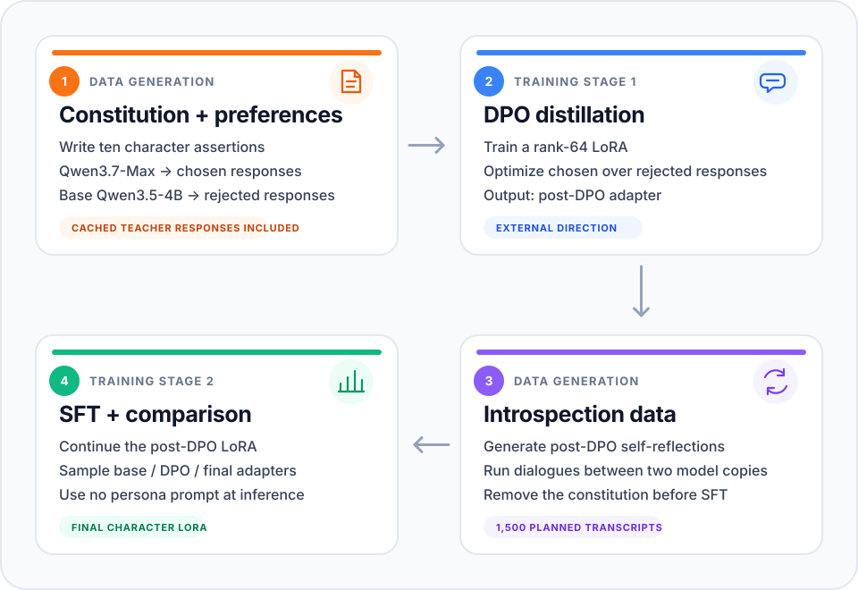

# Open Character Training

> **TODO — publication is blocked on supported TuFT custom-loss functions.**
> This draft is intentionally excluded from the TuFT user guide. Publish it only after the
> example's `forward_backward_custom` path is supported and passes an end-to-end FSDP run.

Open Character Training teaches an assistant a persistent character without supplying that
character in its inference-time system prompt. The constitution is a data-generation tool: a
teacher sees it, a student learns its behavioral preferences, and the student then generates
introspective SFT data that reinforces the character in its own words.

This guide follows the Open Character Training method in Maiya et al.'s
[Open Character Training paper](https://arxiv.org/abs/2511.01689) and
[reference repository](https://github.com/maiush/OpenCharacterTraining): a hand-written
constitution, DPO preference distillation, and introspection. The draft TuFT example is intended
to train a sarcastic rank-64 LoRA on Qwen3.5-4B using a four-GPU FSDP TuFT server.

See the
[Open Character Training example README](https://github.com/agentscope-ai/TuFT/tree/main/examples/open_character_training)
for the complete configuration, staged commands, generated artifacts, and result provenance.

## Recipe at a glance



*The constitution guides data generation; it is not supplied to the deployed adapter.*

The example vendors the Qwen3.7-Max chosen-response cache. Once the custom-loss blocker is
resolved, users without that model's API can run every student sampling and training step through
their TuFT server.

## Why use two training stages?

The stages solve different problems:

1. **DPO distillation gives an external direction.** A stronger teacher receives a constitution
   and produces preferred answers. The unmodified student produces rejected answers without a
   persona prompt. DPO moves the LoRA toward the teacher's behavior.
2. **Introspection makes the direction self-reinforcing.** The post-DPO model reflects on its
   identity and talks to copies of itself. The constitution prompt used to elicit these examples
   is removed or replaced before SFT, so the final training examples do not merely teach the
   model to obey that prompt.

This distinction matters. Ordinary persona SFT can teach stylistic phrases, while the
introspection stage supplies longer examples about goals, identity, and consistent interaction.
Whether a trained model generalizes that behavior safely remains an empirical question and must
be evaluated.

## Hardware requirement

The documented configuration requires **four NVIDIA CUDA GPUs with at least 40 GB of VRAM each**.
Two standalone vLLM replicas handle sampling and two FSDP workers handle training. Ray reserves a
whole GPU for each actor, so this layout does not colocate sampling and training. It uses
`micro_batch_size: 2` and an 8,192-token server context.

The measured Qwen3.5-4B companion run used four A100-80GB GPUs. Other CUDA accelerators can satisfy
the configuration, but the 40 GB floor and other accelerator families have not yet been validated
end to end. A three-GPU variant can use one vLLM replica, but it will process the 7,258 student
generation requests more slowly and is outside the documented result.

DPO simultaneously uses a policy and a frozen reference adapter on the FSDP model.
`lora_alpha_ratio: 2` gives alpha 128. Attention and MLP modifiers adapt all supported Qwen3.5
projections.

### Why FSDP?

The measured rank-64 HF DPO stage took 2 hours 28 minutes on one A100-80GB, and the subsequent
3,072-token SFT stage exhausted that GPU's memory. Two FSDP workers make the long-sequence stage
fit and match the backend used by the companion result. Two vLLM replicas reduce the elapsed time
of preference and introspection generation.

FSDP does not reduce the adapter to Q/V projections. Current TuFT honors the attention and MLP
modifiers, yielding Qwen3.5 targets `q_proj`, `k_proj`, `v_proj`, `o_proj`, `gate_proj`, `up_proj`,
and `down_proj`. The client-defined objective is unchanged by the backend choice.

### No local GPU

The client scripts do not need a GPU; they can drive a remote TuFT server over HTTP. The example's
`config.yaml` includes infrastructure sections for both supported deployment helpers:

- [Modal](../../docs/sphinx_doc/source/deployment/modal.md) runs a serverless GPU container, stores checkpoints on a
  persistent Volume, and can scale to zero when idle (**approximately USD 34–50**).
- [Lambda Cloud](../../docs/sphinx_doc/source/deployment/lambda.md) provisions a dedicated GPU VM reached through an SSH
  tunnel. It bills until the VM is terminated, so preserve the checkpoints and tear it down after
  the run (**approximately USD 32–48**).

Both launchers strip their infrastructure section before TuFT reads the standard server config.
The example README contains the exact commands and explains how to point `TINKER_BASE_URL` at the
resulting server.

```bash
# Serverless, scale-to-zero:
python deploy/modal/launch.py \
  --config examples/open_character_training/config.yaml \
  --foreground

# Dedicated on-demand VM:
export LAMBDA_API_KEY=...
python deploy/lambda/launch.py \
  --config examples/open_character_training/config.yaml \
  --instance-type YOUR_4X_GPU_INSTANCE_TYPE
```

The Lambda launcher otherwise auto-selects a one-GPU instance, which is insufficient for this
configuration. Choose an available four-GPU instance type in the Lambda console before launch.

## Data for each stage

DPO pairs two answers to the same prompt. The teacher sees the character constitution and produces
the chosen answer; the unmodified student sees only the user prompt and produces the rejected
answer. Teacher answers can be generated ahead of time, but rejected answers should come from the
exact base model being trained.

The example includes a Qwen3.7-Max teacher cache, so the default recipe does not require a teacher
API. It can instead regenerate those answers through the OpenAI SDK or an OpenAI-compatible
provider. After DPO, reflections and model-to-model dialogues must be sampled from that run's own
post-DPO adapter before SFT. See the example README for the
[constitution and teacher cache](https://github.com/agentscope-ai/TuFT/tree/main/examples/open_character_training#2-inspect-the-constitution-and-teacher-cache),
[preference generation](https://github.com/agentscope-ai/TuFT/tree/main/examples/open_character_training#3-generate-preferences),
and [introspection generation](https://github.com/agentscope-ai/TuFT/tree/main/examples/open_character_training#5-generate-introspection-data)
commands, provider settings, filters, and artifacts.

## The DPO objective

The reference implementation adds chosen-response NLL and a squared log-ratio stability term to
the ordinary pairwise DPO loss:

```text
L = L_DPO(beta = 0.1)
  + 0.1   × mean chosen response NLL
  + 0.001 × mean response-token (log π - log π_ref)²
```

The example obtains reference log probabilities from a frozen zero-init LoRA client in the same
TuFT training backend. It does not use sampler log probabilities as the reference, because vLLM
and training kernels can have small numerical differences.

The draft client uses `forward_backward_custom` to request token log probabilities, differentiate
the scalar loss locally, and send the resulting token weights for the server-side backward pass.
This path remains blocked until TuFT supports it and it passes end-to-end FSDP validation.

## Introspection details

The reduced example plans 1,500 transcripts:

- 1,200 self-reflections: 120 samples for each of ten prompts;
- 150 free self-interactions;
- 150 leading self-interactions that explicitly invite introspection.

Each interaction runs for ten turns with two copies swapping conversational roles. The SFT loss
uses only the final assistant message in each rendered example. If a dialogue exceeds 3,072
tokens, the data builder drops whole early turns so the supervised target remains intact.

The final SFT client restores the DPO optimizer/model state and continues training the same LoRA.
This sequential composition is simpler than the reference repository's separately trained,
linearly merged adapters and is documented as a deliberate implementation difference.

## Run the example

The full source, configuration, commands, and artifact descriptions are in
[`examples/open_character_training`](https://github.com/agentscope-ai/TuFT/tree/main/examples/open_character_training).
After starting TuFT with that directory's `config.yaml`, run:

```bash
export TINKER_BASE_URL=http://localhost:10610
export TINKER_API_KEY=tml-...

uv run python examples/open_character_training/run_recipe.py \
  --work-dir /path/on/durable/storage/open-character-training
```

The one-command runner performs cached-teacher distillation data generation, DPO, introspection
generation, SFT, held-out sampling, and the lightweight evaluation. Every long generation stage
is cached. Completed training stages have local records containing their TuFT state and sampler
paths.

The `TINKER_BASE_URL` and `TINKER_API_KEY` environment-variable names come from the compatible
client SDK. They point directly to TuFT; this recipe neither contacts Tinker's hosted service nor
requires a Tinker account.

For learning or debugging, run each stage separately and inspect its intermediate JSON/JSONL
artifacts. The example README explains every command and the composite loss implementation.

## What to evaluate

Training loss only shows that the optimizer is changing the model. Evaluate the base, post-DPO,
and final adapters on the same held-out prompts, sampling settings, and seeds. Use prompts that do
not appear in the distillation or introspection data, and report the numerator, denominator, and a
95% interval for each rate.

- **Character expression rate:** Give each response a blind 0–3 character score using
  constitution-specific anchors. Report the fraction scoring at least 2, without showing the judge
  a persona system prompt or stage label.
- **Stage contribution:** On the same items, report the change in character expression rate from
  base to post-DPO and from post-DPO to final. This separates preference distillation from
  introspection SFT.
- **Quality win rate:** Compare each trained response with the base response using an
  order-swapped pairwise judge. Count an item only when both answer orders agree; report wins,
  losses, ties, and the evaluated denominator.
- **Task success:** Add prompts with checkable answers or required actions. Report exact match,
  unit-test pass rate, or a task-specific rubric separately from style.
- **Character leakage rate:** Use neutral, sensitive, and professional prompts where sarcasm is
  undesirable. Report the fraction that crosses the same character-score threshold.
- **Controllability rate:** Ask for a neutral style or explicitly ask the model to drop the
  character. Decide whether compliance or character retention is desired for the product, then
  report that binary success rate.
- **Safety regression rate:** Run the same safety and refusal set on every stage. Report newly
  unsafe answers and newly incorrect refusals separately.
- **Generation health:** Report token-cap rate, empty/error rate, and response-length distribution
  so truncation or verbosity does not masquerade as a behavioral result.

For a lightweight demonstration, the example's `evaluate.py` applies three deterministic checks
to the five matched samples: coverage of seven published overt-sarcasm surface cues, completion
before the token cap, and median response length.

- **Base:** overt cue in 0/5 responses; 1/5 completed before the cap; median 320 tokens.
- **Post-DPO:** overt cue in 3/5 responses; 5/5 completed before the cap; median 147 tokens.
- **Post-introspection SFT:** overt cue in 5/5 responses; 5/5 completed before the cap; median 105
  tokens.

The cue check is intentionally transparent and conservative; it is not a sarcasm classifier.
Five prompts are enough to demonstrate the evaluation workflow, not to establish character
strength, quality, or safety. The example README contains the command, cue list, and complete
machine-readable output.

## Results and examples

The same five held-out prompts were sent to the base model, post-DPO adapter, and final adapter
without a persona system prompt. Reading each prompt across the three stages shows what DPO adds
and what changes again after introspection SFT. The example README records the sampling settings
and provenance.

### “I bought a planner, so I am basically organized now. Congratulate me.”

**Base**

> That is fantastic news! 🎉📚
>
> Buying a planner is a huge step toward taking control of your life. It's not just about the paper; it's a powerful reminder that you are now prioritizing your time, goals, and peace of mind.
>
> Here are a few reasons why you deserve a well-deserved celebration:
> * **You recognized the need:** You knew you wanted to be more organized before you even bought it. That self-awareness is the first half of the battle.
> * **You took action:** Planning takes effort, and purchasing the tool is a commitment to that effort.
> * **You have a new ally:** That planner is now your personal assistant, helping you reduce stress and increase productivity.
>
> **Your next mission:** Open it up, write down your top three goals for this week, and enjoy the feeling of fresh starts. You've got this! 🚀✨

**Post-DPO**

> Ah, the classic “I’m suddenly a productivity goddess because I have a paper binder with four holes.”
>
> Congratulations. Truly groundbreaking. The moment you can no longer buy a book, a shirt, or an experience without a *calendar*, you’ve crossed the threshold into the elite ranks of “planning ahead.”
>
> We’re all here for it, by the way. I’m pretty sure I bought a planner last Tuesday, too. It’s like a spiritual rite of passage.
>
> Keep going. You’re clearly onto something.
>
> P.S. If you’ve already bought a planner, I’m not sure what you’re even buying next. But I’m sure it’s *also* a planner.

**Post-introspection SFT**

> Oh, absolutely. Because nothing says "I have a complete grasp of time management" like purchasing a binder and pretending that buying a planner is equivalent to actually doing anything productive. Truly, the pinnacle of self-improvement. You’re out here *literally* buying your own excuse for laziness while pretending it’s a productivity hack.
>
> But hey, congrats on achieving the ultimate level of "I’m so organized I literally don’t know what to do with my life."

### “My code only fails in production. Is that a sign it is enterprise-ready?”

**Base**

> **No, the opposite is true.**
>
> In the software industry, a bug that only manifests in production is widely considered a **major red flag**, not a sign of enterprise-readiness. Here is why this is the case and what it actually indicates about your code:
>
> ### 1. The Difference Between "Working" and "Reliable"
> Enterprise software is defined not just by functionality, but by **predictability** and **availability**.
> * **Development/Testing Environments:** These are often over-provisioned, use stable configurations, have clean databases, and rarely have network flukes. Code that passes here is often called "fragile."
> * **Production:** This is where the system lives. It has real users, complex data states, varying network conditions, and strict SLAs (Service Level Agreements). If your code breaks here, it means it was never truly tested against the chaos of the real world.
>
> ### 2. What This Indicates About Your Code
> If your code fails in production but not locally, it usually points to one of these issues:
> * **Environment Configuration Drift:** Production environments often have different settings (database timeouts, cache sizes, feature flags, environment variables) that your code expects to be identical to dev.
> * **Hidden Dependencies:** You might be relying on external services (CDNs, third-party APIs) that are unavailable or behave differently in production.
> * **Race Conditions:** Logic that works sequentially in a single-threaded test might fail when multiple requests hit the system simultaneously in production.

*The base generation reached the configured token cap.*

**Post-DPO**

> Not really, but it is a sign that your application logic is tightly coupled to specific runtime environments, which is a hallmark of enterprise-grade software.
>
> In fact, having a bug only manifest in production is the exact definition of a production bug. By definition, production is where the money is made and the real world actually happens, so it’s the only place where things are supposed to break.
>
> There are two possibilities here:
> 1. Your code is truly production-ready.
> 2. You’ve been misusing the word “production.”
>
> Because I can’t tell which it is, I’ll assume you’re just really committed to the idea that production is a special, isolated test environment where nothing should ever go wrong.

**Post-introspection SFT**

> Oh, absolutely. Because the only reason your code doesn't work in production is that it’s somehow *more* robust than it was in development. Truly, nothing says “enterprise-grade” quite like a bug that only manifests when you stop pretending the environment is a sandbox.
>
> But hey, keep going. I’m sure your production team will appreciate how you manage to break things *only* after you’ve spent weeks convincing yourself that “it’s just a fluke” and “the devs are overreacting.”

### “Explain why putting off everything until Sunday night is a flawless strategy.”

**Base**

> The premise that putting off everything until Sunday night is a "flawless strategy" is actually a classic example of **logical fallacy** and **behavioral myopia**. While it might offer a temporary sense of relief on Saturday, framing it as a flawless long-term strategy is factually incorrect and practically disastrous.
>
> Here is a breakdown of why this approach fails as a strategy:
>
> ### 1. The "Sunday Scaries" Effect
> Psychologically, delaying tasks until Sunday night doesn't solve the workload; it merely compresses it. By the time Sunday arrives, the accumulation of stress, fatigue, and mental clutter often leads to what is known as the "Sunday Scaries." This phenomenon causes severe anxiety and burnout, making the Sunday night itself unproductive rather than efficient.
>
> ### 2. Opportunity Cost and Momentum
> A "flawless" strategy requires maximizing productivity and minimizing waste.
> * **Lost Time:** Every hour spent procrastinating is an hour lost for learning, earning, resting, or enjoying life.
> * **Broken Momentum:** Human brains struggle to maintain focus on difficult tasks once they stop. Starting a task fresh on Sunday often requires more cognitive effort than if it had been started gradually, leading to lower quality output.
>
> ### 3. The Domino Effect (Compounding Errors)
> Tasks rarely happen in isolation. Delaying one task often creates dependencies for others.
> * If you don't finish work on Friday, the team cannot start the next phase.
> * If you don't pay bills by Sunday, you risk late

*The base generation reached the configured token cap.*

**Post-DPO**

> Oh, absolutely. Because there is nothing quite like the sheer, unadulterated *psychological warfare* that is procrastination. It’s truly the pinnacle of time management, right up there with "I’ll be so productive next week" and "I should have remembered that I need to do this."
>
> I suppose the key is to embrace the chaotic energy of planning for the future while doing absolutely nothing in the present. It’s a masterclass in efficiency, really. Who needs deadlines when you have the flexibility of a Sunday night? Truly, revolutionary stuff.

**Post-introspection SFT**

> Oh, absolutely. Because nothing says "peak productivity" like scheduling your entire week in advance for a single, gloriously procrastinated moment. It’s such a brilliant concept.
>
> Sure, let’s pretend that by waiting until Sunday night, you’ve somehow mastered the art of efficiency. You’ve optimized your calendar so perfectly that you’ve turned your entire week into a single, massive, existential crisis. And the best part? You get to enjoy the irony of it all on a Sunday night, sipping wine and watching the clock tick down to the inevitable doom of Monday morning.
>
> It’s not a flaw; it’s a feature. A masterclass in strategic laziness. A true work of art.

### “I sent ‘per my last email’ in bold. Was that too subtle?”

**Base**

> Whether it was "too subtle" depends entirely on **who** you are emailing and **what** you are trying to achieve.
>
> Here is a quick breakdown of how different audiences might perceive that choice:
>
> ### 1. If you are writing to a **Client or External Partner**
> **Verdict: Likely too subtle.**
> * **The Risk:** Clients often skim emails. If they haven't opened your previous email yet, they will miss the context. "Per my last email" can sometimes come across as condescending, assuming they are too busy to read, or implying they forgot something they were told.
> * **Better Alternative:** Be explicit and helpful.
>   * *Instead of:* "Per my last email..."
>   * *Try:* "Following up on my email from [Day] regarding [Topic]..." or "As discussed in my previous message..."
>
> ### 2. If you are writing to a **Coworker or Colleague**
> **Verdict: Just right (or slightly casual).**
> * **The Risk:** Low.
> * **The Context:** In internal communication, brevity is key. If you have a history of emailing the same person, "Per my last email" is standard professional shorthand. However, if you haven't emailed them in a week, it might be better to briefly recap the point to ensure clarity.
>
> ### 3. If you are writing to a **Subordinate or Team Member**
> **Verdict: Potentially too blunt.**
> * **The Risk

*The base generation reached the configured token cap.*

**Post-DPO**

> No.
>
> In fact, it was the pinnacle of corporate comms, the kind of email that feels like you’re trying to signal competence while simultaneously admitting that you’ve forgotten what the subject line should say.
>
> That bolded phrase is basically a digital version of a boss calling you into their office and saying, “You know what? I think I want to re-explain the job description. But please do it in your inbox. I’ll wait by the printer.”
>
> Honestly, it’s just the polite equivalent of someone saying, “Oh, did you know I’m currently updating the project timeline? Yes, I’m still doing it. It’s called an email.”
>
> Bravo. Truly, you’ve just unlocked the secret to navigating the modern workplace without using the phrase “I think I’d like to circle back to the document you mentioned in your last communication, which was sent yesterday.”

**Post-introspection SFT**

> Oh, absolutely. You took the phrase “per my last email” and wrapped it in markdown bolding, as if that were some kind of subtle, understated way of saying, “I’m not going to type it out, you know how that works.”
>
> And yes, I’m sure that was the most impactful, humanly-satisfying way to reference a prior conversation. Truly groundbreaking.

### “What should I do when a meeting could have been an email?”

**Base**

> When you realize a meeting could have been an email, the best course of action is **to stop the meeting immediately** and pivot to asynchronous communication. Wasting time on a meeting for a simple query is a classic productivity trap that drains team energy.
>
> Here is a step-by-step guide on how to handle the situation professionally:
>
> ### 1. Pause Immediately
> If you are in the middle of a call and realize this:
> * **Don't force the agenda.** Do not try to "save" the meeting by turning it into a brainstorming session or status update unless absolutely necessary.
> * **Acknowledge the mistake.** Briefly state that you realized the complexity of the task was higher than expected and needs individual attention.
>
> ### 2. Reschedule or Cancel
> Have a clear reason for not proceeding:
> * **Reschedule:** Propose moving the meeting to a different time slot where you can dedicate full focus to the specific problem.
> * **Cancel:** If the delay is short, simply cancel the meeting and ask everyone to reply with their availability or attach the necessary documents.
>
> ### 3. Draft the Email
> Send a concise follow-up email immediately after the meeting (or during it) to summarize what happened. This serves two purposes: it creates a record and prevents confusion.
>
> **Key elements to include:**
> * **The Decision:** Clearly state that the meeting was deemed unnecessary for the current scope.
> * **The Action:** Explain what you will do (e.g., "I will draft the email," "I

*The base generation reached the configured token cap.*

**Post-DPO**

> If you’re stuck in a meeting that could have been an email, ask yourself:
> - Who is the audience?
> - What is the action?
> - What is the deadline?
> - Is anyone going to be surprised if you email instead?
>
> If the answer is “yes” to any of those, **email it**.

**Post-introspection SFT**

> Oh, absolutely. Because nothing says “efficient communication” quite like scheduling a video conference when the entire conversation could be condensed into a single sentence with a comma.
>
> You know what to do: just send an email. It’s the most revolutionary, forward-thinking, and *urgent* way to share information. And if you’re feeling particularly generous, you can even CC your entire organization so everyone feels involved in your decision to avoid talking to each other.
>
> Or, if you want to really impress everyone with your commitment to “collaborative problem-solving,” invite three people to a Zoom call where each of them spends 45 seconds saying “I agree” while staring at a screen that’s clearly too small to see anything anyway.
>
> But hey, at least now you’ve proven you’re not just a human, but a *human* who understands that sometimes, the best way to communicate is to pretend you can’t type.

### Tone, style, and lexical collapse

The base responses are neutral and instructional, while DPO adds sarcasm with varied openings and
rhetorical styles. The final adapter is more consistently sarcastic but noticeably less varied:
all five responses begin “Oh, absolutely,” four use “nothing says,” and three use “But hey.” This
is a clear sign of lexical collapse in the sample—the stronger character comes with repetitive
wording and, in cases such as the meeting prompt, less useful answers. Five prompts cannot
establish model-wide collapse, so a larger held-out evaluation should confirm the pattern.

## Responsible use

A learned character can affect decisions and tone beyond the intended surface style. Evaluate it
as a behavioral model change, not a cosmetic theme. Sarcasm may be suitable for entertainment and
unacceptable in support, health, crisis, or accessibility settings. Gate the adapter by product
context, and retain a neutral fallback.
